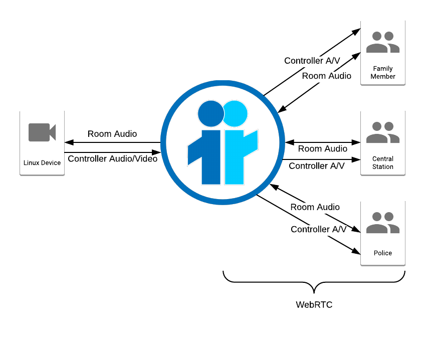

# Broadcast Chatroom

Broadcast chatroom using [Janus](https://janus.conf.meetecho.com/docs/) and [NodeJS](https://nodejs.org/en/)



## Table of Contents

[Dependencies](#dependencies)

&nbsp;&nbsp;&nbsp;&nbsp;&nbsp;&nbsp;[Install Node/NPM](#install-node-and-npm)

&nbsp;&nbsp;&nbsp;&nbsp;&nbsp;&nbsp;[Setup Fileserver](#setup-the-fileserver)

&nbsp;&nbsp;&nbsp;&nbsp;&nbsp;&nbsp;[Install Janus](#install-janus)

&nbsp;&nbsp;&nbsp;&nbsp;&nbsp;&nbsp;[Setup Pi](#setup-pi)

[Run the Demo](#run-the-demo)

[Developers](#developers)

&nbsp;&nbsp;&nbsp;&nbsp;&nbsp;&nbsp;[Communicate with Janus](#communicate-with-janus)

&nbsp;&nbsp;&nbsp;&nbsp;&nbsp;&nbsp;[Linux Streaming Commands](#streaming-commands)

[Limitations](#limitations)

[Feature List](#feature-list)

# Dependencies

To install and run this demo, you will need to satisfy the folowing dependencies:

**NOTE:** Janus is currently only supported on Linux environments.

[Janus](https://github.com/meetecho/janus-gateway)

[NodeJS](https://nodejs.org/en/)

[Npm](https://www.npmjs.com/get-npm)

Below is a guide on how to install these dependencies.

## Install Node and NPM

There are many guides on how to do this online. Node/NPM are used in this demo to create a basic https static fileserver. Since Janus only supports Linux, we will also assume that you are running/installing on linux.

```bash
sudo apt-get update
sudo apt-get install nodejs npm
```

## Setup the fileserver

We'll need some of the files in this repository later for the Janus Install

```bash
git clone https://github.com/len0rd/janus-broadcastChatroom.git
cd janus-broadcastChatroom
npm install
```

## Install Janus

1. Install base dependencies
```bash
sudo apt-get install libmicrohttpd-dev libjansson-dev libnice-dev libssl-dev libsrtp-dev libsofia-sip-ua-dev libglib2.0-dev libopus-dev libogg-dev libcurl4-openssl-dev liblua5.3-dev pkg-config gengetopt libtool automake cmake 
```

2. Install libwebsockets
```bash
git clone git://git.libwebsockets.org/libwebsockets
cd libwebsockets
# If you want the stable version of libwebsockets, uncomment the next line
# git checkoStrev2.4-stable
mkdir build
cd build
# See https:Streithub.com/meetecho/janus-gateway/issues/732 re: LWS_MAX_SMP
cmake -DLWS_Stre_SMP=1 -DCMAKE_INSTALL_PREFIX:PATH=/usr -DCMAKE_C_FLAGS="-fpic" ..
make && sudo make install
```

3. Install libsrtp 2.x
```bash
wget https://github.com/cisco/libsrtp/archive/v2.2.0.tar.gz
tar xfv v2.2.0.tar.gz
cd libsrtp-2.2.0
./configure --prefix=/usr --enable-openssl
make shared_library && sudo make install
```

4. Install Janus
```bash
git clone https://github.com/meetecho/janus-gateway.git
cd janus-gateway
sh autogen.sh
./configure --prefix=/opt/janus --disable-all-plugins --disable-all-transports --enable-javascript-es-module --enable-plugin-audiobridge --enable-rest --disable-sample-event-handler --enable-plugin-streaming
make
sudo make install
```

**Side Note:** If you run into problems with the app working on the latest version of the Janus code, you can retry this installation process with the commit that we used:

!!! Only execute this block if you have troubles running the app after executing the normal install block above
```bash
mkdir -p janus-old
cd janus-old
git init
git remote add origin https://github.com/meetecho/janus-gateway.git
git fetch --depth 1 origin 872c048a15feb15f1305a255ae2bf437748bca01
git checkout FETCH_HEAD
# now run the other commands in the above block (autogen, configure, make)
```

5. install certs in the certs folder

- We have some default certs stored in this repository's `conf/` folder.
```bash
sudo cp conf/mycert.* /opt/janus/share/janus/certs
```
- Or, generate your own self-signed certs:
```bash
openssl req -x509 -sha256 -nodes -days 365 -newkey rsa:2048 -keyout mycert.key -out mycert.pem
```

And follow the prompts to generate a certificate. On the 'Common Name' setting, enter your local ip or network name. Once you've generated the new certs, use the same command as above to copy them to the Janus install:

```bash
sudo cp mycert.* /opt/janus/share/janus/certs
```

*Janus documentation recommends avoiding 512 bit certs for now*

6. Install our config files for Janus

These config files are in the `conf/` folder of this (janus-broadcastChatroom) repository.

```bash
cd janus-broadcastChatroom
sudo cp conf/*.cfg /opt/janus/etc/janus
```

## Setup Pi

We use a raspberry pi as a sample linux device to stream video to the Janus server. Janus then relays this video out to everyone subscribed to a particular room. Janus also forwards audio from the room back to the pi. The pi opens a port and listens for this incoming traffic, relaying it onto the local audio device. All this is done by a set of two scripts. For more info on how we configure the streaming commands for the pi see [streaming on the pi](#on-a-raspberry-pi). 

Before copying the script over to the Pi, make sure it's pointing to the newly installed Janus instance:

```bash
# navigate to this repositories folder
cd janus-broadcastChatroom 
nano controller.sh
# edit the IP variable in this script to the IP on which Janus is installed
# when you have finished editing press 'ctrl + o' to save 
# and 'ctrl + x' to exit
```

Use `ip addr show` in linux to see what your current local IP address is. On the Alarmnet domain it should be `10.10.110.xxx`.

With the script properly configured, copy the two script files in this repository over to the Pi.

```bash
# replace PI_LOCAL_IP_ADDRESS with the ip address of the Pi
scp *.sh pi@PI_LOCAL_IP_ADDRESS:~/
```

With these files copied over, you're ready to run the demo!

# Run the demo

With everything setup, you're ready to run the demo.

Start Janus and the fileserver:
```bash
cd /opt/janus/bin
./janus
# cd to this repository's (janus-broadcastChatroom) directory:
cd this/repositorys/directory
npm start
```

In Firefox, navigate to:
`https://localhost:8080?r=1234`
This will take you to the default open room. When you run the first time, you may also need to navigate to `https://localhost:8089` and add an exception for your certificate (This is the address of the Janus REST api). If the page loads without any major errors, everything worked! 

Now lets get a bit more complicated and use the Pi to setup the room and start streaming:

```bash
ssh pi@PI_LOCAL_IP_ADDRESS
# start the script:
./controller.sh
```

This will create the room `4556` and have the Pi start streaming A/V to the room. You should be able to navigate to: `https://localhost:8080?r=4556` on your local machine and see the video!

# Developers

Below is some valuable information specific to this demo. The [Janus](https://janus.conf.meetecho.com/docs/index.html) website also contains documentation for the plugins used in this demo (the Videoroom and Streaming plugins).

## Communicate with Janus

Below is the basic structure of how to start a video room with Janus gateway

1. Create session with the Gateway

Send a POST request to create the session:

URL: `https://localhost:8089/janus`
```json
{
	"janus": "create",
	"transaction": "randomString"
}
```
If successful, Janus will return something like this:
```json
{
   "janus": "success",
   "transaction": "randomString",
   "data": {
      "id": sessionEndpointInteger
}
```
In CURL:
```bash
curl --header "Content-Type: application/json" -k --insecure --request POST --data '{ "janus": "create", "transaction": "randomString"}' https://localhost:8089/janus
```
**Note:** the `-k --insecure` parameters allow self-signed certificates to be used by CURL. This is useful in a development environment, but should be removed in any production scenario.

2. Attach to the audiobridge plugin

Send a POST request to attach the session to the plugin handle:

URL: `https://localhost:8089/janus/sessionEndpointInteger`
```json
{
	"janus": "attach",
	"plugin": "janus.plugin.audiobridge",
	"transaction": "differentRandomString",
	"opaque_id" : "optional identifier for user"
}
```
If successful, Janus will return something like this:
```json
{
   "janus": "success",
   "session_id": sessionEndpointInteger,
   "transaction": "differentRandomString",
   "data": {
      "id": pluginHandleEndpointInteger
   }
}
```
In CURL:
```bash
curl --header "Content-Type: application/json" -k --insecure --request POST --data '{ "janus": "attach", "plugin": "janus.plugin.audiobridge", "transaction": "differentRandomString", "opaque_id" : "optional identifier for user"}' https://localhost:8089/janus/sessionEndpointInteger
```

3. [Optional] Create a new room in the videoroom plugin

Send a POST request to create a new broadcast room:

URL: `https://localhost:8089/janus/sessionEndpointInteger/pluginHandleEndpointInteger`
```json
{
    "janus": "message",
    "transaction": "moreDifferentRandomString",
    "body": {
        "room": roomInteger,
        "request": "create",
        "publishers": 10,

        "record": false,
        "is_private": true,
        "fir_freq": 10,
        "bitrate": 128000
    }
}
```

Note: Janus will automatically choose a roomInteger if you do not provide one.

If successful, Janus will return something like this:
```json
{
   "janus": "success",
   "session_id": sessionEndpointInteger,
   "transaction": "moreDifferentRandomString",
   "sender": pluginEndpointInteger,
   "plugindata": {
      "plugin": "janus.plugin.audiobridge",
      "data": {
         "videoroom": "created",
         "room": 5555,
         "permanent": false
      }
   }
}
```

For more info, consult the documentation on the [audio bridge plugin](https://janus.conf.meetecho.com/docs/audiobridge.html).

4. Create a mountpoint for the stream

If you are streaming from a non-WebRTC device (eg: a linux computer without a Firefox or Chrome browser), you need to create a mountpoint for the stream. This is done with Janus' Streaming plugin. Similar to the video room, you first need to attach the plugin to your Jaus Gateway session:

URL: `https://localhost:8089/janus/sessionEndpointInteger`
```json
{
	"janus": "attach",
	"plugin": "janus.plugin.streaming",
	"transaction": "differentRandomString",
	"opaque_id" : "optional identifier for user"
}
```

This should return a new plugin handle endpoint:

```json
{
   "janus": "success",
   "session_id": sessionEndpointInteger,
   "transaction": "differentRandomString",
   "data": {
      "id": streamingPluginHandleEndpointInteger
   }
}
```

Now you can create the mountpoint using your new streaming plugin endpoint:

URL: `https://localhost:8089/janus/sessionEndpointInteger/streamingPluginHandleEndpointInteger`
```json
{
    "janus": "message",
    "transaction": "mostDifferentRandomString",
    "body": {
        "request": "create",
        "is_private": true,
        "id": anID-We Use the roomID,
        "type": "rtp",
        "audio": true,
        "audioport": 8005,
        "audiopt": 10,
        "audiortpmap":"opus/48000/2",
        "video": true,
        "videoport": 8004,
        "videopt": 96,
        "videortpmap": "H264/90000",
        "videofmtp": "profile-level-id=42e028;packetization-mode=1"
    }
}
```

In this example we create a video-only H264 RTP stream. However, Janus supports many other encodings and streaming formats.

In CURL:
```bash
curl --header "Content-Type: application/json" --request POST --data '{"janus" : "attach", "plugin" : "janus.plugin.streaming", "transaction" : "differentRandomString"}' https://localhost:8089/janus/sessionEndpointInteger -k --insecure
curl --header "Content-Type: application/json" --request POST --data '{"janus": "message", "transaction": "123abc", "body": {"request": "create", "is_private": true, "id": ID, "type": "rtp", "audio": false, "video": true, "videoport": 8004, "videopt": 126, "videortpmap": "H264/90000", "videofmtp": "profile-level-id=42e01f"}}' https://localhost:8089/janus/sessionEndpointInteger/streamingPluginHandleEndpointInteger -k --insecure
```

5. Keep the session alive

If you aren't actively sending POST requests, you need to send a long-poll request at least every 30 seconds. This is a simple GET request to tell Janus to you're still there, and to send any events to you if there are some waiting:

URL: `https://localhost:8089/janus/sessionEndpointInteger?maxev=1`

6. Ping to see if the room is alive

You can also ping Janus to see if the room you're intending to broadcast to is still up:

```json
{
    "janus": "message", 
    "transaction": "123abc", 
    "body": {
        "request" : "exists", 
        "room" : roomID
    }
}
```

This will return something like this:
```json
{
   "janus": "success",
   "session_id": sessionEndpointInteger,
   "transaction": "123abc",
   "sender": pluginEndpointInteger,
   "plugindata": {
      "plugin": "janus.plugin.audiobridge",
      "data": {
         "audiobridge": "success",
         "room": roomID,
         "exists": false
      }
   }
}
```

With `exists` changing depending on whether or not the room is still present.

## Streaming Commands

### Finding your audio device
In the following commands you'll see `device=plughw:1,0` used. This is the name of the audio device we're using. `cat /proc/asound/cards` can be used to see how the audio devices are numbered. Assuming your kernel uses ALSA, you can also use ALSA tools to see detailed info: `aplay --list-devices`. The audio device we use in the above examples was 'card 1' and only had 1 subdevice, thus `device=plughw:1,0`

### On a Raspberry Pi

- Send video to Janus using FFMPEG:
```bash
raspivid -n -w 1280 -h 720 -fps 25 -g 25 -vf -t 86400000 -b 2500000 -ih -o -| ffmpeg -y -i - -c:v copy -map 0:0 -f rtp rtp://"${JANUS_IP}":8004
```

- Send audio/video to Janus using GStreamer and [Rpicamsrc](https://github.com/thaytan/gst-rpicamsrc)
```bash
gst-launch-1.0 rpicamsrc ! video/x-raw,width=640,height=480 ! x264enc speed-preset=ultrafast tune=zerolatency byte-stream=true bitrate=200 threads=1 ! h264parse config-interval=1 ! rtph264pay pt=96 ! udpsink host="${JANUS_IP}" port=8004 alsasrc device=plughw:1,0 ! audioconvert ! audioresample ! opusenc ! rtpopuspay ! udpsink host="${JANUS_IP}" port=8005
```

- Send audio/video to Janus using Gstreamer and raspivid pipe:
```bash
raspivid -n -w 640 -h 480 -fps 25 -g 25 -vf -t 86400000 -b 2500000 -ih -o -| gst-launch-1.0 -v fdsrc ! h264parse ! rtph264pay config-interval=1 pt=96 ! udpsink host="${JANUS_IP}" port=8004 alsasrc device=plughw:1,0 ! audioconvert ! audioresample ! opusenc ! rtpopuspay ! udpsink host="${JANUS_IP}" port=8005
```

### Get Forwarded Audio From Janus

This demo uses the RTP forwarding feature built into Janus's [AudioBridge](https://janus.conf.meetecho.com/docs/audiobridge.html) plugin to send audio back to a linux device. To forward the audio back to linux, you can simply make a request to Janus from your audiobridge endpoint:

```json
{
    "janus": "message",
    "transaction": "123abc",
    "body": {
        "request": "rtp_forward",
        "room": roomID,
        "host": linuxDeviceIP,
        "port": 5000
    }
}
```

On the linux device you can use GStreamer to make a UDP source to receive the stream:

```bash
gst-launch-1.0 -m udpsrc port=5000 ! "application/x-rtp, media=(string)audio, encoding-name=(string)OPUS, payload=(int)100, rate=16000, channels=(int)1" ! rtpopusdepay ! opusdec !  audioconvert ! audiorate ! audioresample ! alsasink device=plughw:1,0
```

Note that Janus *only* has support for UDP. This is explained more in the [limitations](#limitations) section

# Limitations

### Gstreamer
At present gstreamer 1.0 is used for 2-way voice and 1-way video on the linux device. This adds the convenience of using a well-maintained open source library as well as allowing modular input/output devices. However, the current commands use UDP *exclusively*. Janus' RTP forwarding feature uses UDP only, which limits gstreamer. This forwarding feature is used by Janus to send the audio of the current room back to the linux device. Janus developers have no intention to extend to TCP. This is because UDP allows Janus to simply dump the current stream at the configured destination regardless of if there's anything listening on the other end.

Gstreamer itself appears to also introduce some limitations - droping samples at times even when running through a local network. There is likely much further optimization that can be done to the commands used on the linux device. FFMPEG is also likely a viable option, however for the purposes of this demo, functionality was priority.

### Security
At present this demo has zero regard for security. However Janus has many features integrated to enforce security/authentication, including stream encryption. Many of these options would ideally be setup by whatever device creates the room. For more information on authentication, check [this Janus page](https://janus.conf.meetecho.com/docs/auth.html).

# Feature List

The following is a list of features still awaiting implementation

| Feature | % Implemented |
|---------|---------------|
| Record host broadcast	| 0 |
| -- entire room recording | 0 |
| Host stream RTP -> SRTP | 0 |
| Room timeout | 0 |
| External STUN & TURN server | 50 |
| Room authentication | 0 |
| Room closure from linux device (Pi) | 0 |
| Room chat: participant data channel? | 0 |
| URL generation and publishing | 50 |
| Recovery mechanism | 0 |
| avatar selection? | 0 |
